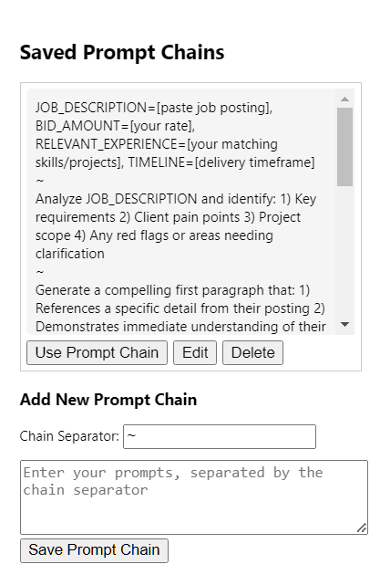

# 🔗 Chains - ChatGPT Workflow Automation

**Smart Prompt Chains for Enhanced AI Productivity**

[](https://github.com/your-username/chatgpt-chain-ext)
[](LICENSE)
[](https://chrome.google.com/webstore)

> Automate ChatGPT conversations with intelligent prompt chains. Create, save, and execute multi-step workflows with custom starting positions, real-time progress tracking, and advanced controls.



## ✨ Features

### 🎯 **Smart Workflow Management**
- **Create Custom Chains**: Build multi-step prompt sequences for complex tasks
- **Start Anywhere**: Choose any step in your chain as the starting point
- **Save & Reuse**: Store unlimited prompt chains for repeated workflows
- **Visual Progress**: Real-time tracking with status indicators and progress bars

### 🔧 **Advanced Controls**
- **Pause/Resume**: Take control of your automation at any time
- **Step Navigation**: Move forward/backward through steps when paused
- **Custom Delays**: Set timing between prompts with `$wait 30s$` syntax
- **Pause Points**: Add strategic pause points with `$pause$` commands
- **Image Throttling**: Automatic pacing for image generation commands

### 📊 **Intelligent Monitoring**
- **Live Status**: See exactly which command is executing
- **Queue Preview**: View upcoming and completed steps
- **Error Recovery**: Graceful handling of connection issues
- **Floating Panel**: Draggable control interface that stays out of your way

### ⚙️ **Flexible Configuration**
- **Custom Separators**: Use `~`, newlines, or any character to split prompts
- **Timing Controls**: Adjust delays between commands
- **Visual Preferences**: Toggle progress indicators and pause notifications
- **Smart Storage**: Local storage for large chains, sync for settings

## 🚀 Quick Start

### Installation

1. **Download the Extension**
   ```bash
   git clone https://github.com/your-username/chatgpt-chain-ext.git
   cd chatgpt-chain-ext
   ```

2. **Load in Chrome**
   - Open Chrome and go to `chrome://extensions/`
   - Enable "Developer mode"
   - Click "Load unpacked"
   - Select the extension directory

3. **Navigate to ChatGPT**
   - Go to [chatgpt.com](https://chatgpt.com)
   - The extension icon should appear in your toolbar

### Basic Usage

1. **Create Your First Chain**
   ```
   Write a blog post outline about AI productivity tools~
   Expand the first section with detailed examples~
   Create a compelling introduction paragraph~
   Add a conclusion with actionable takeaways
   ```

2. **Choose Your Starting Point**
   - Select any step from the dropdown (e.g., "Step 2: Expand the first section...")
   - Click "▶️ Play Chain"

3. **Monitor Progress**
   - Watch the floating control panel for real-time status
   - Pause/resume as needed
   - Navigate between steps when paused

## 📖 Usage Examples

### Content Creation Workflow
```
Research the latest trends in [TOPIC]~
Create a detailed outline with 5 main points~
Write an engaging introduction~
Develop each main point with examples~
Create a compelling conclusion~
Generate 10 social media posts promoting the content
```

### Research & Analysis
```
Summarize the key points from this document: [PASTE_CONTENT]~
Identify the main themes and patterns~
$wait 10s$~
Create a comparative analysis with industry standards~
Generate actionable recommendations~
$pause$~
Format the findings into a professional report
```

### Code Development
```
Review this code for potential improvements: [PASTE_CODE]~
Identify any security vulnerabilities~
Suggest performance optimizations~
$wait 15s$~
Rewrite the code with improvements~
$pause$~
Create unit tests for the improved version~
Generate documentation for the functions
```

## ⚙️ Advanced Configuration

### Wait Commands
Add delays between prompts for better pacing:
- `$wait 5s$` - 5 second delay
- `$wait 2m$` - 2 minute delay
- `$wait 30s$` - 30 second delay

**Legacy Support**: Old `$sleep` syntax still works:
- `$sleep5s$`, `$sleep2m$`, `$sleep30s$`

### Pause Commands
Add strategic pause points for manual intervention:
- `$pause$` - Pause execution for manual review/action
- `Ask for user feedback $pause$` - Execute prompt then pause
- `$pause$` (standalone) - Simple pause point

### Custom Separators
Choose your preferred prompt separator:
- `~` (default) - Simple tilde separator
- `\n` - Newline separation for multi-line chains
- `###` - Custom text separator
- `||` - Double pipe separator

### Settings Configuration
- **Default Delay**: Time between commands (default: 5 seconds)
- **Image Throttle**: Pause after N image commands (default: 5)
- **Image Delay**: Pause duration for image throttling (default: 2 minutes)
- **Visual Indicators**: Toggle pause notifications and progress panel

## 🎛️ Control Panel Features

The floating control panel provides comprehensive workflow management:

### Status Indicators
- **✅ Completed**: Commands that have finished
- **📤 Submitting**: Currently sending to ChatGPT
- **⏳ Waiting**: Awaiting ChatGPT response
- **⏭️ Next**: The upcoming command
- **⏸ Queued**: Future commands in the pipeline

### Interactive Controls
- **Play/Pause Button**: Start, stop, or pause execution
- **Stop Button**: Completely halt the current chain
- **Navigation**: Move between steps when paused
- **Progress Bar**: Visual completion percentage

## 🔧 Technical Details

### Browser Compatibility
- ✅ Chrome (Manifest V3)
- ✅ Edge (Chromium-based)
- ❌ Firefox (requires Manifest V2 conversion)

### Permissions Required
- `storage` - Save chains and settings
- `activeTab` - Detect ChatGPT pages
- `scripting` - Inject automation scripts

### File Structure
```
chatgpt-chain-ext/
├── manifest.json       # Extension configuration
├── popup.html          # Extension popup interface
├── popup.js            # Popup logic and UI
├── content.js          # ChatGPT page automation
├── chains.png          # Extension icon
└── README.md           # This documentation
```

## 🛠️ Development

### Building from Source
```bash
# Clone the repository
git clone https://github.com/your-username/chatgpt-chain-ext.git
cd chatgpt-chain-ext

# Install dependencies for testing
npm install

# No build process required - load directly in Chrome
```

### Contributing
1. Fork the repository
2. Create a feature branch (`git checkout -b feature/amazing-feature`)
3. Commit your changes (`git commit -m 'Add amazing feature'`)
4. Push to the branch (`git push origin feature/amazing-feature`)
5. Open a Pull Request

### Testing
- Install dependencies with `npm install`
- Test on various ChatGPT conversation types
- Verify chain execution with different separators
- Test pause/resume functionality
- Validate error handling scenarios
- Run unit tests with `npm test`

## 📝 Changelog

### Version 1.1
- ✨ Added custom starting position selection
- 🎨 Enhanced visual progress tracking with status indicators
- 🔧 Improved error handling and connection recovery
- 📊 Real-time command queue visualization
- ⚡ Better control panel with draggable interface

### Version 1.0
- 🎉 Initial release
- ⚙️ Basic prompt chain functionality
- 💾 Save and load chain capabilities
- ⏱️ Wait/pause command support
- 🎛️ Floating control panel

## 🤝 Support

### Common Issues
- **"Could not establish connection"**: Refresh the ChatGPT page and try again
- **Extension not working**: Ensure you're on chatgpt.com
- **Chains not saving**: Check browser storage permissions

### Getting Help
- 📧 Email: support@your-domain.com
- 🐛 Issues: [GitHub Issues](https://github.com/your-username/chatgpt-chain-ext/issues)
- 💬 Discussions: [GitHub Discussions](https://github.com/your-username/chatgpt-chain-ext/discussions)

## 📄 License

This project is licensed under the MIT License - see the [LICENSE](LICENSE) file for details.

## 🌟 Acknowledgments

- Thanks to OpenAI for creating ChatGPT
- Inspired by the need for workflow automation in AI interactions
- Built with ❤️ for the AI productivity community

---

**Made with ❤️ for ChatGPT power users**

[⭐ Star this repo](https://github.com/your-username/chatgpt-chain-ext) | [🐛 Report Bug](https://github.com/your-username/chatgpt-chain-ext/issues) | [✨ Request Feature](https://github.com/your-username/chatgpt-chain-ext/issues)
