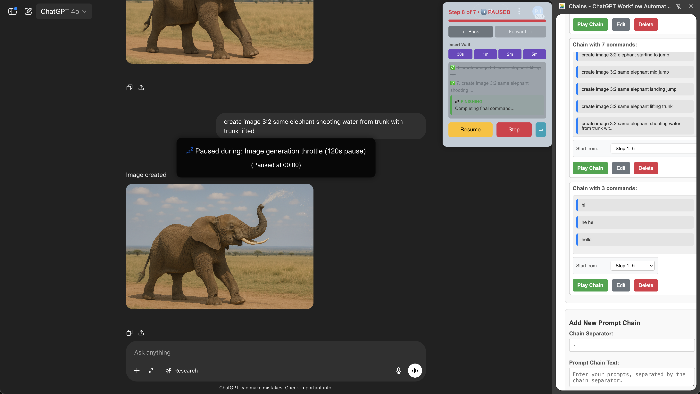
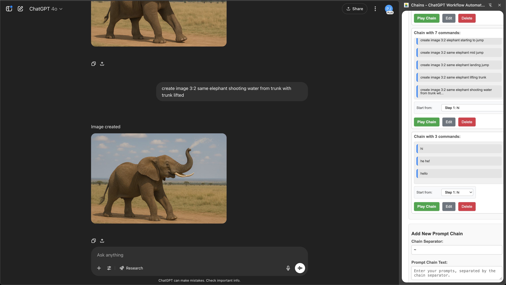

# Chains - ChatGPT Workflow Automation

**Smart prompt chains for enhanced AI productivity.**

[](LICENSE)
[](https://developer.chrome.com/docs/extensions/develop/migrate)

Chains is a Chrome extension (Manifest V3) that automates multi-step conversations on AI chat sites. You write a sequence of prompts separated by a delimiter, save it as a "chain", and play it back against the chat page: the extension types each prompt, sends it, waits for the response to finish, applies any delays or throttling you configured, and moves to the next step. A floating control panel tracks progress in real time, and execution state survives page reloads.

- Supported sites: `chatgpt.com` (primary, fully wired), `gemini.google.com` and `claude.ai` (registered with placeholder selectors — see [Adding more websites](#adding-more-websites))
- Site: [GitHub Pages promotion page](https://hisingh23.github.io/chatgpt-chain-ext/) ([docs/index.html](docs/index.html))
- Privacy: everything is stored locally; nothing leaves your device — see [PRIVACY.md](PRIVACY.md)




## Why

Long AI workflows — research passes, content pipelines, iterative code reviews, batch image generation — are repetitive: paste prompt, wait for the answer, paste the next one. Chains removes the paste-wait-paste loop while keeping you in control: you can pause at any point, step forward or backward, insert extra waits, and resume after a page refresh or a connection error.

## Features

### Workflow management
- **Create custom chains** — multi-step prompt sequences for complex tasks
- **Start anywhere** — pick any step as the starting point when you play a chain
- **Save and reuse** — unlimited named chains stored locally
- **Visual progress** — real-time status indicators, progress bar, and queue preview (completed / submitting / waiting / next / queued)

### Execution controls
- **Pause/Resume** — take control at any time; Back/Forward navigation while paused
- **`$wait` delays** — `$wait 30s$` or `$wait 2m$` between prompts (legacy `$sleep30s$` syntax still supported)
- **`$pause$` points** — run a prompt, then halt for manual review (`Review this draft $pause$`)
- **Quick waits** — Insert Wait buttons (30s/1m/2m/5m) on the control panel
- **Image throttling** — automatic long pause after every N `create image` prompts, with live countdown and a Skip Image Wait button
- **Error recovery** — waits for the site to finish responding, retries via the site's regenerate/retry button, and resubmits failed prompts

### Monitoring surfaces
- **Floating control panel** — draggable, kept inside the viewport on resize, position remembered
- **Sleep indicator** — countdown overlay for active waits (pausable)
- **Popup and side panel** — manage chains and settings from the toolbar popup or Chrome's side panel (context menu: *Show Chain Progress* / *Open Side Panel* / *Toggle Picture-in-Picture*)
- **Picture-in-Picture** — watch the conversation in an always-on-top window with remembered geometry (Document Picture-in-Picture API, Chrome 114+)
- **State persistence** — per-chat progress in `localStorage`; reload the page or reopen the tab and the chain resumes where it left off (within 24 hours)

### Configuration
- **Custom separators** — `~` (default), newline, `###`, `||`, or any text
- **Timing** — default inter-prompt delay (seconds, fractional OK) and image throttle count/delay (minutes)
- **Toggles** — sleep indicator and floating progress panel on/off
- **Smart storage split** — chains in `chrome.storage.local` (large, device-specific), settings in `chrome.storage.sync` (small, synced); one-time migration from old sync-based storage

## Install (unpacked)

1. Clone and enter the repo:
   ```bash
   git clone https://github.com/hsingh23/chatgpt-chain-ext.git
   cd chatgpt-chain-ext
   ```
2. Open `chrome://extensions/` in Chrome (or any Chromium browser, e.g. Edge).
3. Enable **Developer mode** (top-right toggle).
4. Click **Load unpacked** and select the repository root directory.
5. Visit [chatgpt.com](https://chatgpt.com); open the Chains popup from the toolbar to create your first chain.

For a smaller, production-style load, build first and load the generated `dist/` directory instead (see [Development](#development)).

## Basic usage

1. Write a chain in the popup's text area (one prompt per separator):
   ```
   Write a blog post outline about AI productivity tools~
   Expand the first section with detailed examples~
   Create a compelling introduction paragraph~
   Add a conclusion with actionable takeaways
   ```
2. **Save** the chain, pick a **Start from** step in the dropdown, and click **Play Chain**.
3. Watch the floating panel: pause/resume, navigate steps, insert quick waits, or stop entirely. Close the popup — the chain keeps running on the page.

### Example: research and analysis
```
Summarize the key points from this document: [PASTE_CONTENT]~
Identify the main themes and patterns~
$wait 10s$~
Create a comparative analysis with industry standards~
Generate actionable recommendations~
$pause$~
Format the findings into a professional report
```

### Example: code review
```
Review this code for potential improvements: [PASTE_CODE]~
Identify any security vulnerabilities~
Suggest performance optimizations~
$wait 15s$~
Rewrite the code with improvements~
$pause$~
Create unit tests for the improved version
```

## Adding more websites

The DOM selectors for each site live in one file:

1. Add the site's URL pattern to `content_scripts.matches` and `host_permissions` in `manifest.json`.
2. Add an entry with the site's selectors to `siteAdapters.js` (`textareaSelector`, `sendButtonSelector`, `retryButtonSelector`, `speechButtonSelector`, `userMessageSelector`). Anything omitted falls back to the ChatGPT defaults.

The registered `gemini.google.com` and `claude.ai` entries still carry placeholder selectors — updating those two objects is all that is needed to finish their integration.

## Permissions rationale

| Permission | Why it is needed |
|---|---|
| `storage` | Save chains (`storage.local`) and settings (`storage.sync`) |
| `activeTab` | Detect and message the AI chat page you are on |
| `scripting` | Inject the content script on demand if it is not yet loaded |
| `contextMenus` | Right-click menu (progress panel, side panel, PiP toggle) |
| `sidePanel` | Open Chrome's side panel |
| Host permissions (`chatgpt.com`, `gemini.google.com`, `claude.ai`) | Run the content script on those pages only |

No permission is used to read pages other than the matched AI chat sites; see [PRIVACY.md](PRIVACY.md).

## Stack and structure

Plain JavaScript (ES2021), no framework or build step required to run from source. Tooling: Mocha + Node `assert` for tests, ESLint (`eslint:recommended`), Terser + `crx` for packaging. Chrome Manifest V3, minimum Chrome 114 (side panel + Document Picture-in-Picture).

```
chatgpt-chain-ext/
├── manifest.json          # MV3 manifest: scripts, matches, permissions
├── siteAdapters.js        # Per-site DOM selector adapters (runs first)
├── parseCommand.js        # $wait/$sleep/$pause tag parser (content + Node)
├── content.js             # Chain engine: submit, wait, throttle, panels, PiP, state
├── background.js          # Service worker: context menus, side panel
├── popup.html / popup.js  # Toolbar popup: chain CRUD, settings, start position
├── sidepanel.html         # Side panel UI (same layout as popup, fluid width)
├── test/parseCommand.test.js  # Mocha unit tests for the parser
├── build.js               # Terser minify to dist/, ZIP + CRX packing to build/
├── docs/index.html        # GitHub Pages promotion site
├── PRIVACY.md             # Privacy policy
└── CHANGELOG.md           # Full commit-by-commit history
```

## Development

```bash
npm install        # dev dependencies: mocha, eslint, terser, crx
npm test           # run the parseCommand unit tests
npm run lint       # eslint *.js test/*.js
npm run build      # minify JS into dist/, copy assets, pack build/Chains.zip + build/Chains.crx
```

The build generates `key.pem` (CRX signing key) on first run if missing; it is git-ignored — never commit it. Load `dist/` as an unpacked extension for a production-like build, or install the CRX directly.

### Testing checklist
- `npm test` and `npm run lint` pass
- Chain executes with each separator (especially newline mode)
- Pause/resume, Back/Forward navigation, `$pause$` and `$wait` behavior
- Reload mid-chain: state restores and resumes correctly
- Error recovery when the send button is unavailable

## Compatibility

- Chrome and Chromium-based browsers (Edge) — Manifest V3, Chrome 114+
- Firefox is not supported (MV2 conversion and different APIs would be needed)

## License

MIT — see [LICENSE](LICENSE).
